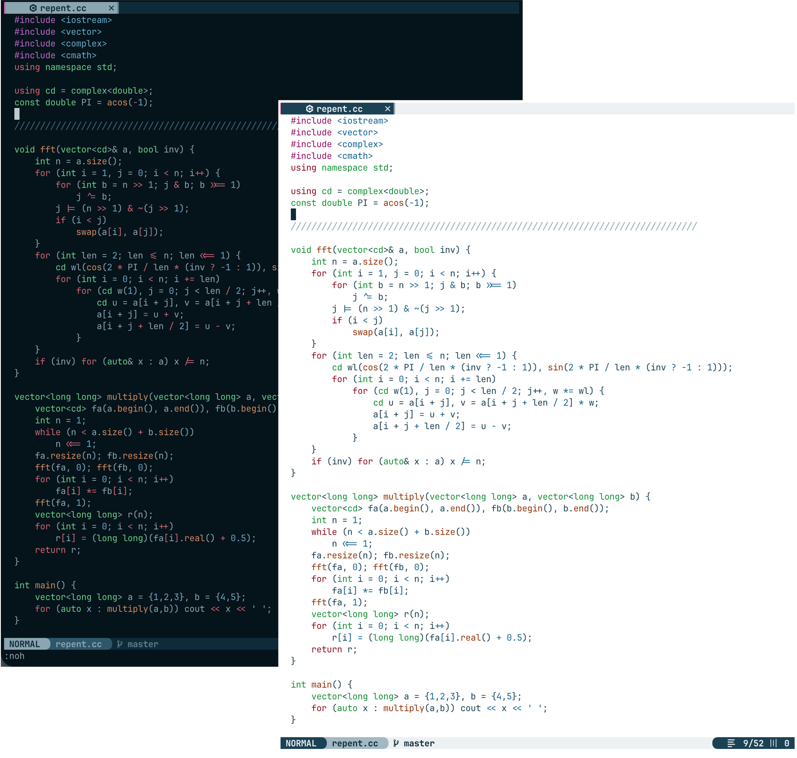

Two colorschemes for Neovim: forsake (dark), and repent (light). 

>And again, believe that ye must repent of your sins and forsake them, and humble yourselves before God; and ask in sincerity of heart that he would forgive you; and now, if you believe all these things see that ye do them." —[Mosiah 4:10](https://www.churchofjesuschrist.org/study/scriptures/bofm/mosiah/4?lang=eng&id=10) 

There are many fantastic dark themes, but not so many good light ones. The themes repent and forsake here use consistent color palettes.



## Installation

Just add this plugin to your package manager. No special configuration is needed other than setting the colorscheme.

### Pack
For Neovim Pack, just use `vim.pack.add({"https://github.com/BYUignite/forsake-repent"})`.
Then, somewhere in the lua configuration, use `vim.cmd("colorscheme repent")` or `vim.cmd("colorscheme forsake")`

### Lazy
For lazy, use
```
{
  "BYUignite/forsake-repent",
  lazy = false, -- load at startup (recommended for colorschemes)
  priority = 1000, -- make sure it loads before other UI plugins
  config = function()
    vim.cmd("colorscheme repent")    -- or forsake
  end,
}
```

## Note
There are corresponding raw colorschemes, not as a plugin, available at [github.com/BYUignite/nvim](https://github.com/BYUignite/nvim) in `colors/forsake2.lua` and `colors/repent2.lua`. Put this `colors` folder in your `~/.config/nvim` folder, then just call `:colorscheme repent2` or `:colorscheme forsake2` to load these (or, in your lua config: `vim.cmd("colorscheme repent2)` etc.).
